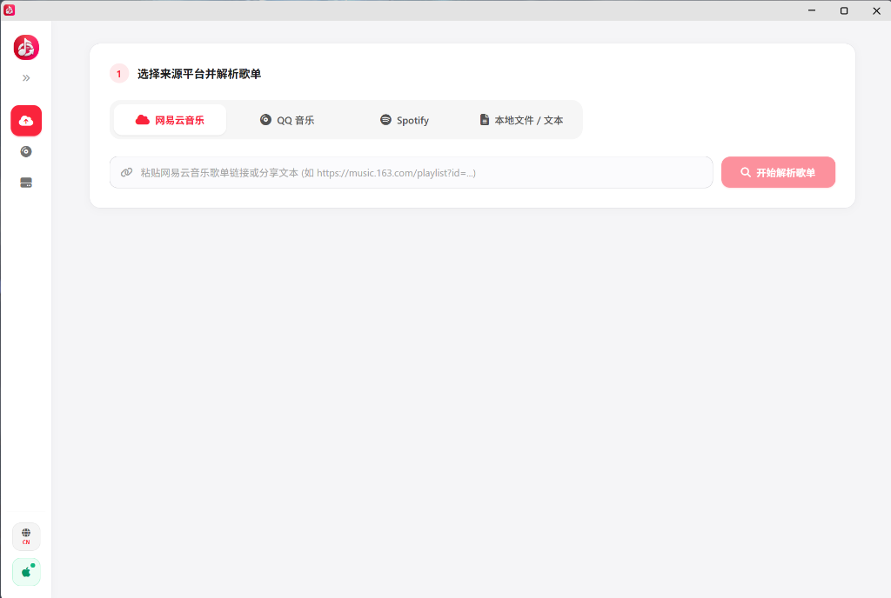
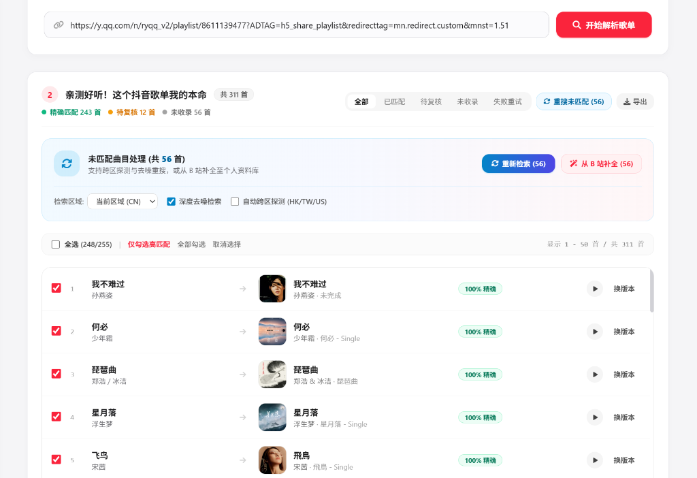
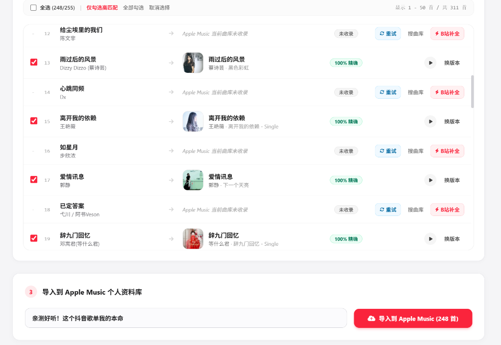

# 🎵 Apple Music Playlist Importer

### 可能是最好用、最优雅的 Apple Music 跨平台歌单搬家与资料库管理神器

**一键迁移网易云 / QQ 音乐 / Spotify 歌单 · B 站音源无损自动补漏 · 真正 100% 完整度迁移 · Windows 单文件绿色版**

  
  
  
  

[📥 立即下载最新版 (免安装 EXE)](https://github.com/RoxyLLL/Apple-Music-Playlist-Importer/releases/latest) · [✨ 核心功能](#-它能用来干什么) · [🚀 3 步上手指南](#-3-步极速上手) · [❓ 常见问题](#-常见问题-faq)

---

> 💡 **无需安装 Python，无需配置复杂环境！**  
> 下载单个 `AppleMusicImporter.exe`，双击即可直接运行。

---

## 🌟 为什么选择它？

从国内音乐平台转到 Apple Music，你是否也遇到过这些头疼的问题？

- ❌ **很多小众歌、Live 现场版在 Apple Music 搜不到**，迁移后歌单缺斤少两；
- ❌ **同名歌曲经常匹配错**，把原版误匹配成了翻唱或纯伴奏；
- ❌ **很多工具还要买几百块的苹果开发者账号**，或者需要手动抓包配置 Token；
- ❌ **歌单里的歌曲导入后乱序**，找不到刚导进去的歌。

**Apple Music Playlist Importer 为解决这些痛点而生：**

| 功能对比 | 传统导入工具 | Apple Music Playlist Importer |
| :--- | :--- | :--- |
| **未收录/下架歌曲** | ❌ 直接丢失，歌单残缺 | ✅ **一键从 B 站补全音源并写入资料库**，实现 100% 完整迁移 |
| **匹配准确率** | ⚠️ 经常串歌（匹配成翻唱/伴奏） | ✅ **智能多维打分**，严格区分 Live/翻唱/原版，支持 30 秒试听 |
| **使用门槛** | ❌ 需安装 Python、Docker 或手动抓包 | ✅ **单文件免安装绿色 EXE**，支持 Edge 一键自动授权 |
| **云端资料库管理** | ❌ 仅支持一次性导歌 | ✅ **全功能资料库管家**（批量删歌/换版本/按加入时间排序） |
| **全设备漫游** | ⚠️ 仅保存在本机 | ✅ **自动同步到 iCloud**，iPhone、iPad、Mac 随时随地收听 |

---

## 🎯 它能用来干什么？

### 1. 跨平台歌单秒速搬家
- 支持粘贴 **网易云音乐**、**QQ 音乐**、**Spotify** 的歌单分享链接或口令。
- 支持直接导入本地 **TXT / CSV** 歌单文件，一键快速解析数百首歌曲。

### 2. 智能高精度匹配 & 原声在线试听
- 自动识别歌曲与歌手，精确区分 **原版 / Live 现场版 / 伴奏版 / Remix 混音**。
- 提供 **30 秒官方原声在线试听** 与 **自由换版本** 功能，不确定的歌曲听完再决定，拒绝张冠李戴。

### 3. B 站音源无损自动补漏（核心特色 🌟）
- 对于 Apple Music 没有版权或下架的歌曲，支持 **一键从 B 站检索原唱音源**。
- 自动转码为高品质音频，自动嵌入**高清专辑封面、歌手信息与 ID3 标签**。
- 自动加入 Apple Music 导入目录并同步至 **iCloud 个人云端资料库**，手机、平板、电脑全端随时听。

### 4. Apple Music 资料库全功能管家
- **歌单管理**：查看、修改歌单名与描述，支持歌单单项与多选批量删除。
- **曲目管理（突破 100 首限制）**：完美支持上千首超大歌单全量浏览与批量移除。
- **歌曲加入时间排序**：默认按 **最新加入时间** 排序，新导入的歌曲一秒就能找到，同时支持按歌名、歌手升降序切换。
- **本地音源管理**：扫描电脑本地音乐文件，支持在文件夹中快速定位、批量修改元数据。

---

## 🚀 3 步极速上手

### 第一步：粘贴歌单链接并解析

打开软件，选择来源平台（网易云/QQ/Spotify/本地文件），直接粘贴歌单链接或分享文本，点击 **“开始解析歌单”**：

  

---

### 第二步：智能匹配核对 & 一键 B 站补全

系统会在数秒内完成曲库并发匹配：
- 🟢 **100% 精确 / 高可信**：已为您默认勾选；
- 🟡 **待复核**：可点击 ▶️ 按钮在线试听 30 秒原声，或点击「换版本」手动挑选；
- 🔴 **未收录歌曲**：点击顶部的 **「从 B 站补全」**，系统自动寻找优质音源下载并放入 Apple Music 资料库！

  

---

### 第三步：一键导入 Apple Music 个人资料库

确认勾选的歌曲，输入歌单名称，点击 **“导入到 Apple Music”**，稍等片刻即可同步完成！打开手机上的 Apple Music App，新歌单已经出现在您的资料库中。

  

---

## 💻 首次使用：连接 Apple ID（30 秒搞定）

在首次导入前，需要连接一次您的 Apple ID（无需开发者账号，普通订阅用户即可）：

1. 点击软件界面右上角的 **“连接 Apple ID”**；
2. 点击 **“启动 Edge 自动抓取 Token”**；
3. 软件会自动调起浏览器打开 Apple Music 网页版，您只需正常扫码或登录您的 Apple ID；
4. 登录成功后，软件将在**后台秒级自动捕获 Token**，客户端提示“已连接”即可开始使用。

> 🔒 **隐私安全承诺**：所有数据均仅在您的本地设备（`127.0.0.1`）运行，Token 仅保存在本地配置文件中，**绝不会上传到任何第三方服务器**。

---

## ❓ 常见问题 (FAQ)

<b>Q1：我需要购买苹果开发者账号（Apple Developer）吗？</b>

 
<b>完全不需要！</b> 本项目通过 Apple Music 官方网页端的安全授权机制，只要您的 Apple ID 拥有 Apple Music 订阅即可正常使用。

<b>Q2：从 B 站补全的歌曲，手机（iPhone/iPad）上能听吗？</b>

 
<b>可以！</b> 程序下载并转码音频后，会自动放入 Apple Music 的自动导入目录。只要您的电脑端 Apple Music 或 iTunes 开启了「iCloud 音乐资料库」，文件就会自动上传到苹果云端，手机端随之自动同步。

<b>Q3：大歌单导入时提示“频控限制”怎么办？</b>

 
当连续检索大量歌曲时，Apple Music 官方接口可能会返回 429 频控。软件内置了智能保护机制，只需等待几秒倒计时结束即可自动恢复并继续，无需手动干预。

<b>Q4：为什么歌单导入后在手机上没看到？</b>

 
1. 请确保手机和电脑登录的是同一个 Apple ID； 
2. 在手机「设置」->「音乐」中，确保开启了<b>「同步资料库」</b>（或「iCloud 音乐资料库」）； 
3. 在手机 Apple Music 资料库下拉刷新一下即可。

---

## 💖 支持与 Star

如果这个小工具帮您解决了歌单迁移的烦恼，欢迎给本项目点一个 **⭐️ Star**！  
您的支持是项目持续维护和迭代的最大动力！

---

## 📄 开源许可证

本项目基于 [MIT License](LICENSE) 开源发布。  
*免责声明：本项目仅供个人音乐备份与学习交流使用，解析内容版权均归各音乐平台及唱片公司所有。*
