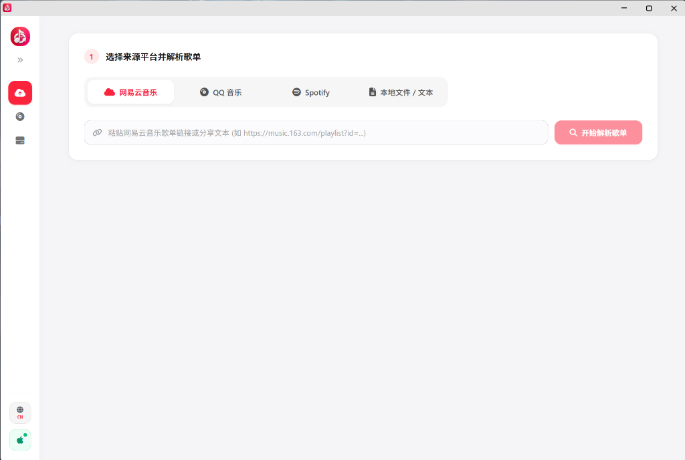
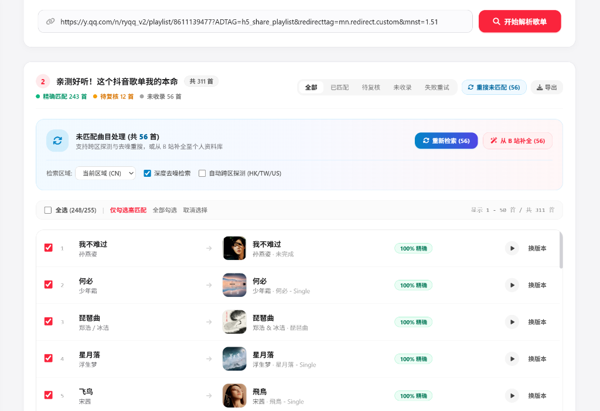
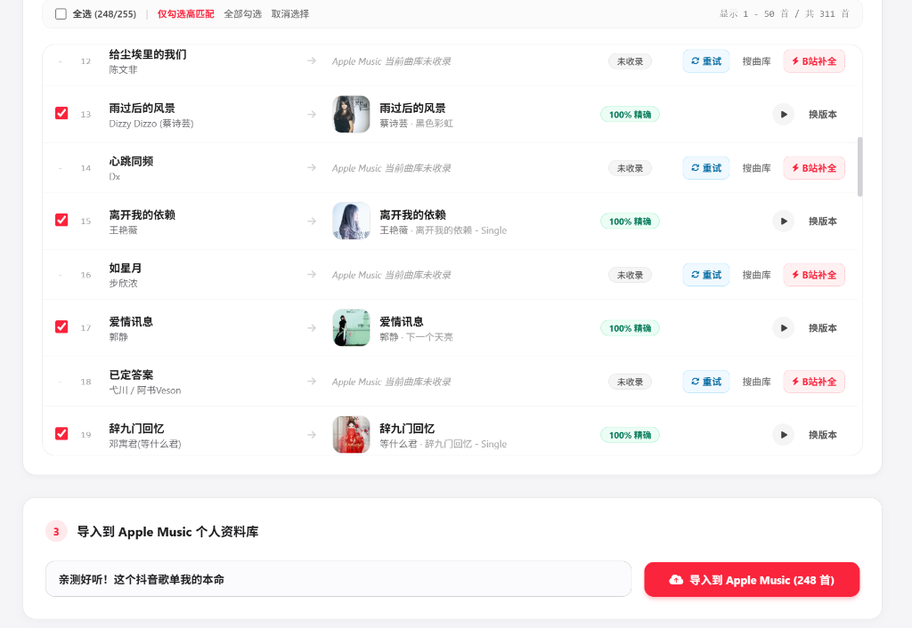

# 🎵 Apple Music Playlist Importer

**English | [简体中文](README.md)**

  
  
  
  
  

[📥 Download Latest Release (Standalone EXE)](https://github.com/RoxyLLL/Apple-Music-Playlist-Importer/releases/latest) · [✨ Key Features](#-key-features) · [🚀 3-Step Quickstart](#-3-step-quickstart) · [❓ FAQ](#-faq)

---

> 💡 **No Python installation or complex environment setup required!**  
> Simply download the standalone `AppleMusicImporter.exe` from [Releases](https://github.com/RoxyLLL/Apple-Music-Playlist-Importer/releases/latest) and double-click to run.

---

## 🌟 Why Choose Apple Music Playlist Importer?

Migrating playlists from platforms like NetEase Cloud Music, QQ Music, or Spotify to Apple Music often leads to common frustrations:

- ❌ **Missing niche songs and Live concerts** not present in Apple Music catalog;
- ❌ **Homonym song false positives**, where original hits are incorrectly replaced by covers or instrumental tracks;
- ❌ **Expensive developer accounts required** by other tools, or painful manual packet sniffing for auth tokens;
- ❌ **Unordered imported tracks**, and Apple’s official client capping batch views at 100 songs.

**Apple Music Playlist Importer is purpose-built to solve every one of these problems:**

| Feature Comparison | Traditional Importers / Plugins | Apple Music Playlist Importer |
| :--- | :--- | :--- |
| **Uncataloged / Unavailable Songs** | ❌ Lost completely, resulting in broken playlists | ✅ **One-click automatic audio retrieval from Bilibili**, embedding artwork & ID3 tags, synced directly to **iCloud Music Library** |
| **Matching Accuracy** | ⚠️ High error rate (mismatched to covers or instrumentals) | ✅ **Intelligent multi-dimensional scoring**, distinguishing Live/Original/Covers with 30s official audio previews and version switching |
| **Ease of Use** | ❌ Requires Python environment or manual proxy sniffing | ✅ **Single-file portable Windows executable (EXE)** with one-click Edge browser automatic Token capture (no Apple Developer account needed) |
| **Cloud Library Management** | ❌ One-time import only | ✅ **Full Library Butler** (bypasses the 100-song cap for batch deletion, version switching, and sorted by newly added date) |
| **All-Device Roaming** | ⚠️ Stored locally on PC only | ✅ **Direct iCloud Music Library integration**, listening seamlessly across iPhone, iPad, Mac, and CarPlay |

---

## 🎯 Key Features

- **Cross-Platform Playlist Migration**: Supports pasting playlist share links from NetEase Cloud Music, QQ Music, and Spotify, or importing local TXT/CSV playlist files.
- **Smart High-Precision Matching**: Automatically identifies tracks and artists, providing 30-second official audio previews and version switching to ensure the right track every time.
- **Automatic Audio Gap-Filling from Bilibili (Flagship Feature 🌟)**: For tracks unavailable on Apple Music, retrieve high-quality audio from Bilibili with embedded album artwork and metadata, synced directly to your iCloud Music Library.
- **Full-Featured Apple Music Library Manager**: Bypasses the 100-song cap to view and batch-remove tracks from large playlists, with sorting by Date Added.

---

## 🚀 3-Step Quickstart

### Step 1: Paste Playlist Link & Parse

Launch the application, select your source platform (NetEase / QQ / Spotify / Local File), paste the playlist URL or share snippet, and click **"Start Parsing"**:

  

---

### Step 2: Review Smart Matches & Auto Gap-Filling

The system matches songs concurrently against the Apple Music catalog within seconds:
- 🟢 **100% Exact / High Confidence**: Pre-selected by default;
- 🟡 **Needs Review**: Click the ▶️ button to play a 30s preview, or click "Switch Version" to pick an alternative;
- 🔴 **Uncataloged Songs**: Click **"Fill with Bilibili"** at the top to automatically fetch high-quality audio and add to your library!

  

---

### Step 3: One-Click Import to Apple Music Library

Verify selected tracks, enter a playlist name, and click **"Import to Apple Music"**. In moments, the playlist is created! Open the Apple Music app on your phone, and your new playlist will be ready.

  

---

## 💻 First-Time Setup: Connect Apple ID (Takes 30 Seconds)

Before your first import, authorize your Apple ID once (no Apple Developer account required; any standard subscriber account works):

1. Click **"Connect Apple ID"** in the top-right corner of the app;
2. Click **"Launch Edge & Auto-Capture Token"**;
3. The built-in Microsoft Edge browser opens Apple Music Web. Simply log in with your Apple ID or scan the QR code;
4. Upon successful login, the app **automatically captures the Music User Token in the background**, and displays "Connected".

> 🔒 **Privacy Guarantee**: All operations run purely locally on your machine (`127.0.0.1`). Credentials and tokens are stored solely in your local configuration and **are never uploaded to any external server**.

---

## ❓ FAQ

<b>Q1: Do I need to buy an Apple Developer account?</b>

 
<b>No, absolutely not!</b> This project uses the official Apple Music web authorization flow. Any standard personal or family Apple Music subscription works out of the box.

<b>Q2: Can I listen to songs filled from Bilibili on my iPhone or iPad?</b>

 
<b>Yes!</b> When audio is retrieved and converted, it is automatically placed in Apple Music's "Automatically Add to Music" folder. As long as "Sync Library" (iCloud Music Library) is enabled in Apple Music or iTunes on your computer, the audio is uploaded to your personal iCloud storage and synced across all your Apple devices.

<b>Q3: What should I do if I encounter a "Rate Limit" prompt when importing large playlists?</b>

 
When fetching metadata for hundreds of tracks in rapid succession, Apple Music API may issue a temporary HTTP 429 rate limit. The software has built-in adaptive rate-limiting protection; simply wait for the countdown to complete, and it will resume automatically without manual intervention.

<b>Q4: Why isn't the imported playlist showing up on my phone?</b>

 
1. Verify that both your computer and phone are signed into the exact same Apple ID; 
2. On your iPhone, open <b>Settings > Music</b> and ensure <b>"Sync Library"</b> is switched ON; 
3. In the Apple Music app on your phone, pull down on the Library tab to trigger a manual refresh.

---

## 💖 Star & Support

If this tool made your music migration easier, please consider giving it a **⭐️ Star**!  
Your support is the greatest motivation for continuous maintenance and new features.

---

## 📄 License

This project is licensed under the [MIT License](LICENSE).  
*Disclaimer: This tool is strictly intended for personal music library backup, learning, and research. All parsed music content and copyright belong to their respective platforms and record labels.*
